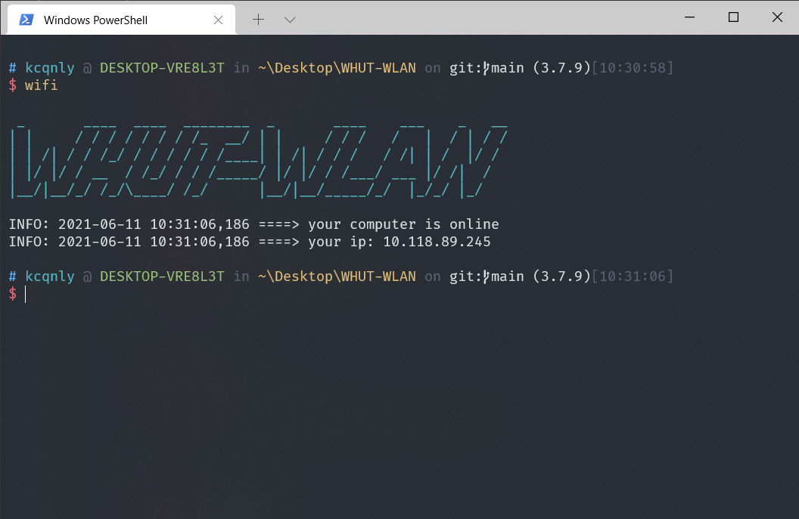

## 前期准备

[官方文档地址](https://docs.microsoft.com/zh-cn/windows/terminal/)

- 打开MicroSoft Store，下载安装Windows Terminal
- 安装[git](https://git-scm.com/)

### 安装oh-my-posh和posh-git

```powershell
Install-Module posh-git -Scope CurrentUser
Install-Module oh-my-posh -Scope CurrentUser
```

### 安装字体

需要安装Nerd Font字体，不然有些终端主题的符号显示乱码。下载地址如下：

[Nerd Fonts - Iconic font aggregator, glyphs/icons collection, & fonts patcher](https://www.nerdfonts.com/font-downloads)

推荐安装FiraCode Nerd Font

## 配置

### 修改PowerShell配置

使用vscode编辑power shell配置文件

```powershell
code $profile
```

添加下面三行（第三行是设置主题）

```powershell
Import-Module posh-git
Import-Module oh-my-posh
Set-PoshPrompt ys
```

### 修改终端配置

点击windows terminal的设置，然后点击打开json文件

```json
"defaults": {
    // 设置字体
    "fontFace": "FiraCode NF",
    // "fontFace": "Cascadia Code PL",
    // 开启毛玻璃
    "useAcrylic": true,
    // 透明度
    "acrylicOpacity": 0.9,
    "colorScheme": "One Half Dark",
    "fontSize": 11,
    "fontWeight": "normal",
    "hidden": false,
    
}
```

在右上角list中添加git bash（2.32.0）

```json
"list": {
    {
        "commandline": "C:/Program Files/Git/bin/bash.exe",
        "icon": "C:/Program Files/Git/mingw64/share/git/git-for-windows.ico",
        "name": "Git Bash"
    },
}
```

## 主题改造

我使用的是ys主题，更多主题样式可以点击[这里](https://ohmyposh.dev/docs/themes/)查看。
以下是我对ys主题的一些改造配置，如果您使用的不是ys主题，可以点击退出了。😜

主题配置文件存放在`C:\Users\xxx\Documents\WindowsPowerShell\Modules\oh-my-posh\3.162.4\themes`下面。

打开并修改`ys.omp.json`。

为什么要修改？因为默认的ys配置会在文件夹里有python文件的情况下显示python的版本号，但是由于默认配置的display_version为false，所以你只会看到一对括号，然后什么都没有。此外，因为每次显示python版本都是另起一行，我个人不是很习惯这种方式。

```json
{
  "$schema": "https://raw.githubusercontent.com/JanDeDobbeleer/oh-my-posh/main/themes/schema.json",
  "blocks": [
    {
      "type": "prompt",
      "alignment": "left",
      "newline": true,
      "segments": [
        {
          "type": "text",
          "style": "plain",
          "foreground": "lightBlue",
          "properties": {
            "prefix": "",
            "text": "#"
          }
        },
        {
          "type": "root",
          "style": "plain",
          "foreground": "red",
          "properties": {
            "root_icon": "%"
          }
        },
        {
          "type": "session",
          "style": "plain",
          "properties": {
            "user_info_separator": " <darkGray>@</> ",
            "prefix": "",
            "user_color": "cyan",
            "host_color": "green"
          }
        },
        {
          "type": "path",
          "style": "plain",
          "foreground": "lightYellow",
          "properties": {
            "prefix": "<darkGray>in </>",
            "style": "full"
          }
        },
        {
          "type": "git",
          "style": "plain",
          "properties": {
            "prefix": "<darkGray>on</> <white>git:</>"
          }
        },
        {
          "type": "python",
          "style": "plain",
          "properties": {
            "prefix": "<white>(",
            "postfix": ")</>",
            "display_version": true
          }
        },
        {
          "type": "time",
          "style": "plain",
          "foreground": "darkGray",
          "properties": {
            "prefix": "[",
            "postfix": "]"
          }
        },
        {
          "type": "exit",
          "style": "plain",
          "foreground": "red",
          "properties": {
            "prefix": " C:",
            "always_numeric": true
          }
        }
      ]
    },
    {
      "type": "prompt",
      "alignment": "left",
      "newline": true,
      "segments": [
        {
          "type": "text",
          "style": "plain",
          "foreground": "lightRed",
          "properties": {
            "prefix": "",
            "text": "$",
            "postfix": ""
          }
        }
      ]
    }
  ],
  "final_space": true
}
```

不需要显示python版本的，可以直接把python那一项删掉。


